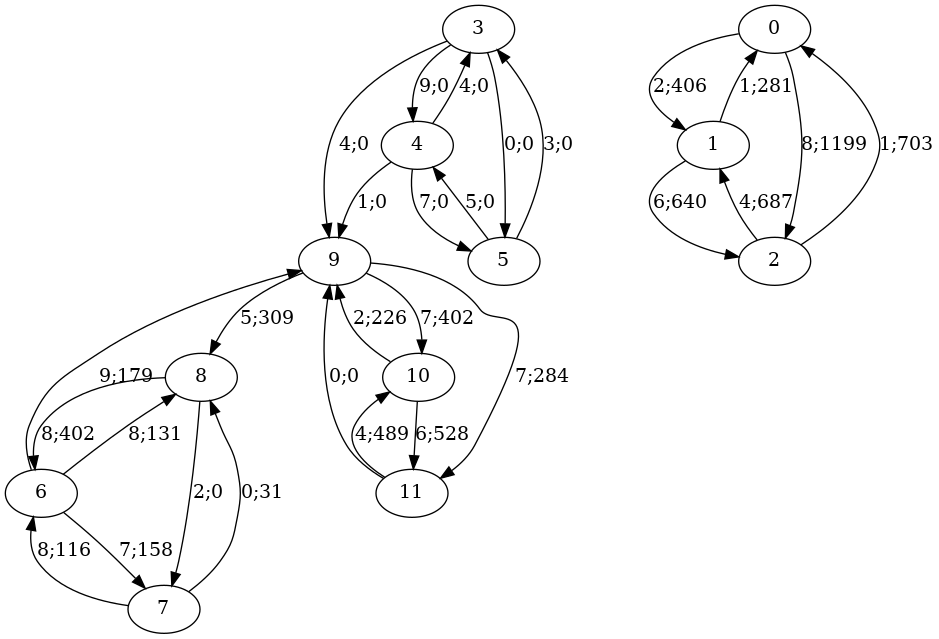

# Algorithme de fourmis distribué

Un algorithme de fourmi est un algorithme qui permet de trouver le plus court chemin dans un graphe. On en propose ici une version distribuée qui permet de traiter des graphes de très grande taille qui ne peuvent pas être chargés sur une seule machine.

Un cluster est utilisé pour effectuer ces traitements. La communication entre les noeuds du cluster peut se faire de différentes manières. On utilise ici une librairie qui fournie une sémantique abstraite pour la communication des messages. Différents "transports" peuvent ensuite être utilisés selon le mécanisme de transfert que l'utilisateur choisit.
(un serveur implémentant le protocôle AMQP, des flux TCPs, des sockets unix, ou une implémentation spécifique).

# Principe

Chaque noeud du cluster ne charge qu'un sous-graphe (de préférence connexe) du graphe entier. Il a connaissance des arrêtes au sein de ce sous-graphe et des arrêtes qui vont d'un sommet de ce sous-graphe à un sommet en dehors de ce sous-graphe.

Chaque noeud du cluster est chargé de faire évoluer son sous-graphe en faisant se déplacer des fourmis dessus. Ces fourmis peuvent soit se déplacer selon une arrête interne, soit venir d'une arrête provenant d'un sommet extérieur soit sortir du sous-graphe par une arrête qui va vers un sommet extérieur.

La communication entre les noeuds leur permet de se transférer entre eux les fourmis qui changent de sous-graphe.

Une fourmi dépose des phéromones lorsqu'elle passe sur une arrête. Lorsqu'elle se trouve sur un sommet elle a connaissance des quantités de phéromone déposées sur les arrêtes sortantes ainsi que les coûts de ces arrêtes. Elle fait un choix aléatoire qui prend en compte ces paramètres et privilégie les arrêtes avec beaucoup de phéromones et des coûts faibles.
Lorsqu'une fourmi arrive à un sommet designé comme étant de la nourriture elle fait le chemin inverse en déposant encore des phéromones. Les fourmis ont aussi un TTL de 50. C'est un nombre qui est décrémenté du coût des arrêtes sur lesquels elles passent et qui provoque leur décès lorsqu'il arrive à 0. Cela permet d'éviter qu'elles èrent à l'infini. Des fourmis sont régulièrement crées au point de départ pour compenser cela.

L'affichage du graphe dans son ensemble est dedié à un noeud distingué qui a pour tâche de receuillir le contenu des sous-graphes qui lui est régulièrement envoyé. Ce noeud concatène ces sous-graphes et génère un fichier au format de la commande `dot` qui permet de générer des images du graphe entier.

Un autre noeud distingué supervise l'ordre des opérations de chaque noeud. Il envoie un message aux noeuds chargés de sous-graphes lorsqu'ils doivent faire avancer leurs fourmis d'une arrête. Il fait aussi office de "routeur de fourmis" lorsqu'une fourmi doit être transferée d'un noeud à l'autre. Enfin, il ordonne l'envoie des informations d'affichage au noeud dedié à l'affichage et lui ordonne la sauvegarde d'une image.

Cet algorithme converge souvent rapidement vers une solution optimale mais est moins rapide que Dijkstra. En revanche il a l'avantage d'être facilement distribuable et de pouvoir s'adapter à évantuels changements du graphe.

Son inspiration vient de l'observation du déplacement des colonies de fourmis dans la nature. Elles envoient des éclaireurs qui disposent les premiers phéromones et se déplacent aléatoirement. Ils ne reviennent qu'après avoir trouvé de quoi se nourrir. Une sélection naturelle se fait sur les chemins qui seront dotés d'avantage de phéromones s'ils sont plus rapide puisque les fourmis y feront plus d'allés-retour.

Les graphes qui sont étudiés sont générés aléatoirement (générateur linéaire congruentiel). D'abord les sous-graphes sont générés indépendament puis concaténés et des arrêtes sont aléatoirement ajoutées dans le graphe entier pour relier la plupart des composantes connexe.

# Détails de l'implémentation

Haskell ne dispose pas dans sa librairie standart de structure de tableau.
On utilise donc la librairie 'massiv' qui propose des opérations sur les tableaux.

La monade State (le transformeur StateT plus exactement) permet d'implémenter des opérations sur un état mutable tout en gardant un code sans effet de bord.

La librairie 'binary' est utilisée pour la sérialization des messages. Elle propose directement de dériver des codages à partid d'un type (via les Generics de GHC) donc aucun encodage spécifique n'est spécifié.

# TODO

- Interface en ligne de commande avec la librairie 'opt-parse-applicative'
- Configuration dans un fichier YAML ou JSON.
- Passage de la configuration dans le code avec une monade ReaderT

